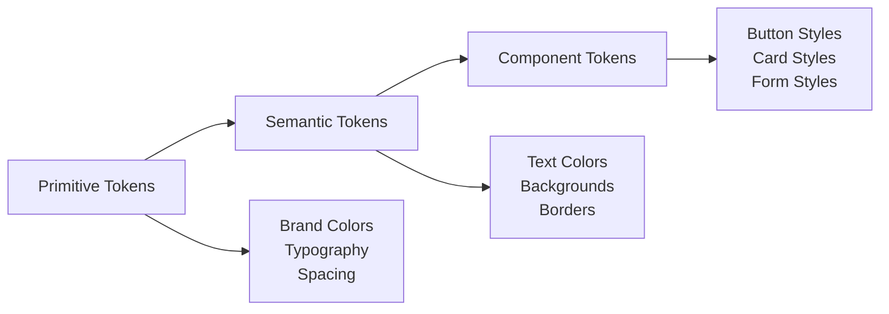

# LeanTechCo Branding Guide

## 🎨 **Brand Identity**

LeanTechCo là công ty công nghệ chuyên về giải pháp chuyển đổi số tinh gọn cho doanh nghiệp Việt Nam. Brand định vị như một đối tác đáng tin cậy, hiện đại và hiệu quả.

---

## 🏷️ **Logo & Typography**

### Logo Design
```
leantechco.
```

**Cấu trúc:**
- `lean` - màu trắng/primary
- `tech` - màu trắng/primary  
- `co.` - màu secondary (#00B8FF)

**Logo Variants:**
- **Primary Logo**: Full color trên nền trắng
- **White Logo**: Toàn bộ trắng trên nền tối
- **Icon Only**: Logo symbol riêng biệt

### Typography Hierarchy

**Primary Font Family:** Inter Variable Font
```css
font-family: "Inter", Arial, sans-serif;
font-optical-sizing: auto;
```

**Font Weights Used:**
- **Light (300)**: Supporting text
- **Regular (400)**: Body text
- **Medium (500)**: Emphasis
- **SemiBold (600)**: Headings
- **Bold (700)**: Major headings

**Type Scale:**
```css
h1: 2.5rem (40px) | font-weight: 700
h2: 2rem (32px) | font-weight: 600  
h3: 1.5rem (24px) | font-weight: 600
Body: 1rem (16px) | font-weight: 400
Small: 0.875rem (14px) | font-weight: 400
```

---

## 🌈 **Color Palette**

### Primary Colors

**Brand Primary**
```css
/* Enterprise Design Token System */
Brand Core: #1331d2 (brand-500)
RGB: 19, 49, 210
HSL: 231°, 83%, 45%

/* Semantic Token Usage */
--interactive-default: #1331d2
--text-link: #1331d2
--border-focus: #1331d2

/* Full Brand Scale */
brand-50: #f0f4ff   /* Lightest tint */
brand-100: #e5edff
brand-200: #d1deff
brand-300: #b8cbff
brand-400: #9fb1ff
brand-500: #1331d2  /* Primary brand color */
brand-600: #0e24a8  /* Hover state */
brand-700: #0a1a7f  /* Active state */
brand-800: #071155
brand-900: #03082b
brand-950: #020419  /* Darkest shade */
```
*Usage: CTAs, links, brand accents, headers, interactive states*

**Brand Secondary**  
```css
#00B8FF - Cyan Blue
RGB: 0, 184, 255
HSL: 197°, 100%, 50%
```
*Usage: Logo accent, highlights, interactive elements*

**Accent**
```css
#F9FAFB - Light Gray
RGB: 249, 250, 251
HSL: 220°, 14%, 98%
```
*Usage: Background, subtle sections*

### Supporting Colors

**Success**
```css
#059669 - Green
RGB: 5, 150, 105
```

**Warning**  
```css
#eab308 - Amber
RGB: 234, 179, 8
```

**Danger**
```css
#dc2626 - Red
RGB: 220, 38, 38
```

**Neutral Grays**
```css
#111827 - Gray 900 (Headings)
#374151 - Gray 700 (Body text)
#6B7280 - Gray 500 (Supporting text)
#D1D5DB - Gray 300 (Borders)
#F3F4F6 - Gray 100 (Backgrounds)
```

### Color Usage Guidelines

**Primary Blue (#1331d2)**
- ✅ Main CTAs and action buttons
- ✅ Navigation active states
- ✅ Form focus states
- ✅ Link colors
- ❌ Large background areas
- ❌ Body text

**Secondary Cyan (#00B8FF)**
- ✅ Logo accent
- ✅ Hover states
- ✅ Gradient combinations
- ✅ Highlight elements
- ❌ Primary CTAs
- ❌ Text content

---

## 📐 **Visual System**

### Border Radius Standards
```css
/* Sharp Angular Design - No Border Radius */
All elements: 0px (Sharp, clean lines)

/* Cards & Containers */
border-radius: 0 (Sharp rectangles)

/* Buttons */
border-radius: 0 (Sharp rectangular buttons)

/* Form inputs */
border-radius: 0 (Clean, professional look)
```

### Shadows
```css
/* Cards */
shadow-lg: 0 10px 15px -3px rgba(0, 0, 0, 0.1)
shadow-xl: 0 20px 25px -5px rgba(0, 0, 0, 0.1)
shadow-2xl: 0 25px 50px -12px rgba(0, 0, 0, 0.25)

/* Buttons */
shadow-md: 0 4px 6px -1px rgba(0, 0, 0, 0.1)
```

### Spacing System
```css
/* Component spacing */
gap-3: 12px (Buttons)
gap-6: 24px (Cards) 
gap-8: 32px (Sections)

/* Section padding */
py-16: 64px (Mobile)
py-20: 80px (Desktop)
py-24: 96px (Large sections)
```

---

## 🎯 **Brand Voice & Messaging**

### Brand Attributes
- **Tinh gọn (Lean)**: Tối ưu, hiệu quả
- **Chuyên nghiệp**: Đáng tin cậy, chất lượng
- **Hiện đại**: Công nghệ mới, innovative
- **Thân thiện**: Dễ tiếp cận, hỗ trợ tốt

### Tone of Voice
- **Professional yet approachable**
- **Confident but not arrogant**  
- **Clear and direct communication**
- **Solution-focused messaging**

### Key Messages
- "Giải pháp chuyển đổi số toàn diện & tinh gọn"
- "Nền tảng công nghệ tối ưu giúp vận hành hiệu quả"
- "Đồng hành cùng doanh nghiệp trong hành trình chuyển đổi số"

---

## 📱 **Visual Elements**

### Icons
**Icon Library:** Font Awesome 6
**Style:** Solid, Regular, Light (Angular/Square preferred)
**Usage:** 
- Navigation: `fa-bars`, `fa-times`
- Features: `fa-check`, `fa-cogs`, `fa-rocket`, `fa-square`
- Social: `fa-facebook-f`, `fa-linkedin-in`, `fa-youtube`
- Status: `fa-check-square`, `fa-square`, `fa-stop`

### Gradients
```css
/* Primary gradient */
background: linear-gradient(160deg, #1331d2, #438eff);

/* Hero background */
background: linear-gradient(90deg, #122796, #3c73ff);

/* Button gradients */
background: linear-gradient(to right, #1331d2, #2563eb);
```

### Glass Effects
```css
/* Glass cards */
background: rgba(255, 255, 255, 0.05);
backdrop-filter: blur(8px);
border: 1px solid rgba(255, 255, 255, 0.1);
```

---

## 🖼️ **Image Guidelines**

### Photography Style
- **High quality, professional imagery**
- **Clean, modern compositions**
- **Business/technology focused**
- **Good contrast for text overlay**

### Image Formats
- **Hero images**: 1920x1080 minimum
- **Product screenshots**: High resolution PNG
- **Icons**: SVG preferred, PNG fallback
- **Logos**: SVG for web, PNG for print

---

## ✅ **Brand Do's and Don'ts**

### ✅ Do's
- Use consistent color palette
- Maintain proper contrast ratios (4.5:1 minimum)
- Follow typography hierarchy
- Use sharp, angular design (no border radius)
- Maintain consistent spacing
- Include hover/focus states
- Use semantic HTML

### ❌ Don'ts  
- Don't use colors outside the palette
- Don't mix different border radius styles
- Don't use less than 16px font size for body text
- Don't ignore accessibility guidelines
- Don't use custom button styles (use button system)
- Don't break visual hierarchy

---

## 📊 **Accessibility Standards**

### Color Contrast
- **Normal text**: 4.5:1 minimum
- **Large text**: 3:1 minimum  
- **Interactive elements**: Clear visual feedback

### Focus States
- **Visible focus indicators**
- **Keyboard navigation support**
- **Screen reader compatibility**

### Font Sizes
- **Minimum body text**: 16px
- **Minimum interactive targets**: 44px
- **Clear visual hierarchy**

---

## 🎯 **User Experience Strategy**

### Navigation Flow
- **Intuitive section progression**
- **Clear call-to-action placement**
- **Mobile-first navigation**
- **Accessibility compliance (WCAG 2.1 AA)**

### Content Strategy
- **Value-driven messaging**
- **Technical credibility through partnerships**
- **Service-to-product progression**
- **Social proof before conversion**

### Page Structure Optimization
```
1. Hero - Value proposition & hook
2. TechPartnerships - Build trust with tech partners
3. Solutions - Services overview  
4. Products - Specific software products
5. WhyUs - Competitive advantages
6. Clients - Social proof & testimonials
7. CTA - Convert visitors
8. Contact - Get in touch
```

**Rationale**: Early trust building through technology partnerships, logical service-to-product flow, and social proof before conversion requests.

**Brand Guidelines Version 1.0**  
*Consistent branding across all touchpoints ensures strong brand recognition and professional presentation.* 

## 🏢 **Enterprise Design Token Integration**

LeanTechCo sử dụng **Enterprise Design Token System** với semantic layering để đảm bảo tính nhất quán và khả năng mở rộng.

### Token Architecture


### Key Benefits
- **Consistency**: Unified design language
- **Maintainability**: Centralized token management  
- **Scalability**: Easy to extend and modify
- **Accessibility**: Built-in accessibility features
- **Developer Experience**: Semantic naming conventions

### Implementation
```css
/* Use semantic tokens instead of hardcoded values */
.component {
  background: var(--bg-primary);
  color: var(--text-primary);
  border: 1px solid var(--border-primary);
  box-shadow: var(--shadow-elevation-1);
}
```

> **📋 Reference**: See `docs/DESIGN_TOKENS_ENTERPRISE.md` for complete token documentation.

--- 