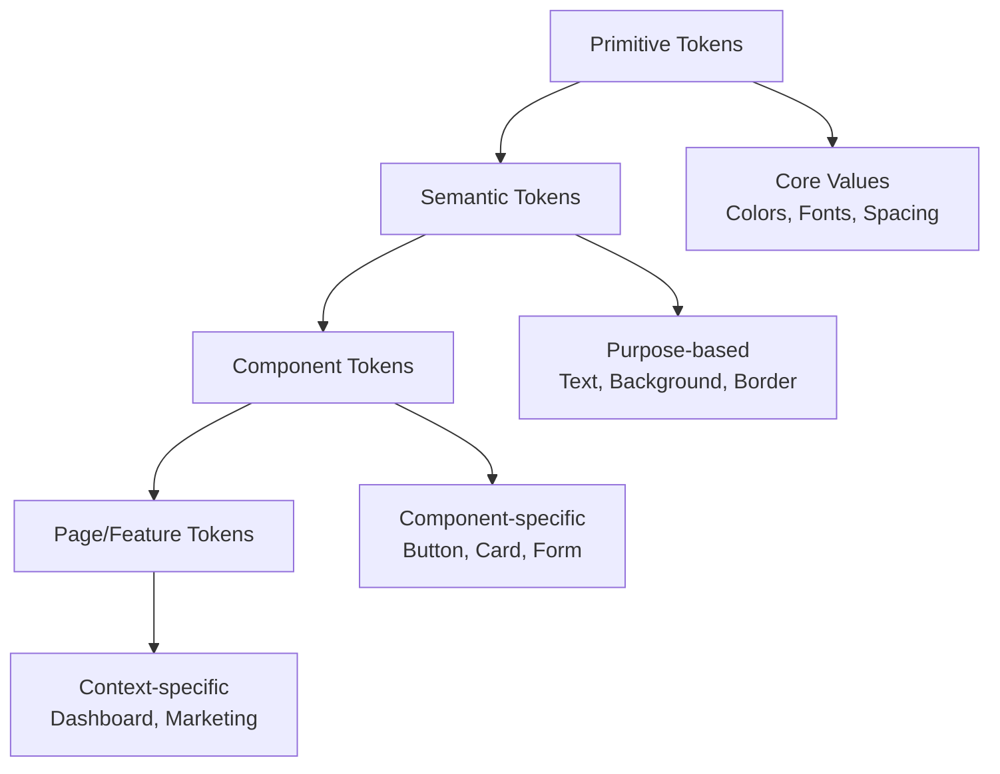

# Enterprise Design Token System

## 🎯 **Tổng Quan**

Hệ thống Design Tokens enterprise-grade với **semantic layering** đầy đủ, được thiết kế để đảm bảo tính nhất quán, khả năng mở rộng và bảo trì trong môi trường doanh nghiệp.

## 🏗️ **Kiến Trúc Token System**



## 📊 **Layer 1: Primitive Tokens**

### Brand Colors
```css
--brand-50: #f0f4ff
--brand-100: #e5edff
--brand-200: #d1deff
--brand-300: #b8cbff
--brand-400: #9fb1ff
--brand-500: #1331d2  /* Primary */
--brand-600: #0e24a8
--brand-700: #0a1a7f
--brand-800: #071155
--brand-900: #03082b
--brand-950: #020419
```

### Status Colors
```css
/* Success */
--success-50 to --success-900

/* Warning */
--warning-50 to --warning-900

/* Error */
--error-50 to --error-900

/* Info */
--info-50 to --info-900
```

### Neutral Grays
```css
--neutral-50: #fafafa
--neutral-100: #f5f5f5
/* ... */
--neutral-950: #0a0a0a
```

## 🎨 **Layer 2: Semantic Tokens**

### Text Tokens
```css
/* Purpose-based color references */
--text-primary: #0e101b        /* Main content */
--text-secondary: #344054      /* Supporting text */
--text-tertiary: #6b7280       /* Helper text */
--text-inverse: #ffffff        /* On dark backgrounds */
--text-disabled: #a3a3a3       /* Disabled states */
--text-link: #1331d2          /* Links */
--text-link-hover: #0e24a8     /* Link hover */
```

### Background Tokens
```css
--bg-primary: #ffffff          /* Main background */
--bg-secondary: #f9fafb        /* Secondary background */
--bg-tertiary: #f3f4f6         /* Cards, panels */
--bg-dark: #0a0a0a            /* Dark backgrounds */
--bg-overlay: rgba(0,0,0,0.5)  /* Modal overlays */
--bg-glass: rgba(255,255,255,0.05) /* Glass morphism */
```

### Border Tokens
```css
--border-primary: #e5e7eb      /* Default borders */
--border-secondary: #d1d5db    /* Stronger borders */
--border-focus: #1331d2       /* Focus states */
--border-error: #ef4444       /* Error borders */
--border-success: #22c55e     /* Success borders */
```

### Interactive States
```css
--interactive-default: #1331d2
--interactive-hover: #0e24a8
--interactive-active: #0a1a7f
--interactive-disabled: #d1d5db
--interactive-focus: #1331d2
```

## 📝 **Typography Token System**

### Semantic Typography Classes
```css
/* Display Typography */
.display-lg    /* 60px, bold, -0.075em */
.display-md    /* 48px, bold, -0.05em */
.display-sm    /* 36px, semibold, -0.05em */

/* Heading Typography */
.heading-lg    /* 30px, semibold, -0.025em */
.heading-md    /* 24px, semibold, -0.025em */
.heading-sm    /* 20px, semibold, 0em */

/* Body Typography */
.body-lg       /* 18px, normal, 0em */
.body-md       /* 16px, normal, 0em */
.body-sm       /* 14px, normal, 0.025em */
.caption       /* 12px, normal, 0.025em */
```

### Font System
```css
/* Font Families */
font-sans: ['Inter', 'system-ui', 'sans-serif']
font-mono: ['JetBrains Mono', 'Consolas', 'monospace']
font-display: ['Inter', 'system-ui', 'sans-serif']

/* Font Weights */
font-light: 300
font-normal: 400
font-medium: 500
font-semibold: 600
font-bold: 700
font-extrabold: 800
```

## 📏 **Spacing Token System (8px Grid)**

### Base Grid
```css
/* 8px Base Unit Grid */
--space-1: 4px     /* 0.25rem */
--space-2: 8px     /* 0.5rem - Base unit */
--space-3: 12px    /* 0.75rem */
--space-4: 16px    /* 1rem */
--space-6: 24px    /* 1.5rem */
--space-8: 32px    /* 2rem */
--space-12: 48px   /* 3rem */
--space-16: 64px   /* 4rem */
--space-20: 80px   /* 5rem */
--space-24: 96px   /* 6rem */
```

### Semantic Spacing
```css
.section-padding: py-20 px-4 sm:px-6 lg:px-8
.section-padding-sm: py-12 px-4 sm:px-6 lg:px-8
.section-padding-lg: py-32 px-4 sm:px-6 lg:px-8
```

## 🎭 **Shadow Token System**

### Elevation Shadows
```css
--shadow-elevation-1: 0 1px 3px rgba(0,0,0,0.12), 0 1px 2px rgba(0,0,0,0.24)
--shadow-elevation-2: 0 3px 6px rgba(0,0,0,0.16), 0 3px 6px rgba(0,0,0,0.23)
--shadow-elevation-3: 0 10px 20px rgba(0,0,0,0.19), 0 6px 6px rgba(0,0,0,0.23)
--shadow-elevation-4: 0 14px 28px rgba(0,0,0,0.25), 0 10px 10px rgba(0,0,0,0.22)
--shadow-elevation-5: 0 19px 38px rgba(0,0,0,0.30), 0 15px 12px rgba(0,0,0,0.22)
```

### Focus Shadows
```css
--shadow-focus-primary: 0 0 0 3px rgba(19,49,210,0.1)
--shadow-focus-error: 0 0 0 3px rgba(239,68,68,0.1)
--shadow-focus-success: 0 0 0 3px rgba(34,197,94,0.1)
```

## ⚡ **Animation & Transition Tokens**

### Timing
```css
--transition-fast: 150ms
--transition-normal: 200ms
--transition-slow: 300ms
--transition-slower: 500ms
```

### Easing Functions
```css
ease-in-out-quart: cubic-bezier(0.77, 0, 0.175, 1)
ease-out-expo: cubic-bezier(0.19, 1, 0.22, 1)
ease-in-out-circ: cubic-bezier(0.785, 0.135, 0.15, 0.86)
```

## 🧩 **Layer 3: Component Tokens**

### Button System
```css
/* Base Button */
.btn {
  /* Uses semantic tokens */
  padding: var(--space-2) var(--space-4);
  border: 1px solid var(--border-primary);
  transition: all var(--transition-normal);
  font-size: theme('fontSize.body-sm');
}

/* Button Variants */
.btn-primary {
  background: var(--interactive-default);
  color: var(--text-inverse);
  border-color: var(--interactive-default);
}

.btn-primary:hover {
  background: var(--interactive-hover);
  box-shadow: var(--shadow-elevation-2);
}
```

### Card System
```css
.card {
  background: var(--bg-primary);
  border: 1px solid var(--border-primary);
  padding: var(--space-6);
  box-shadow: var(--shadow-elevation-1);
}

.card-elevated {
  box-shadow: var(--shadow-elevation-2);
}

.card-interactive:hover {
  box-shadow: var(--shadow-elevation-3);
  transform: translateY(-2px);
}
```

### Form System
```css
.form-input {
  background: var(--bg-primary);
  border: 1px solid var(--border-primary);
  color: var(--text-primary);
  padding: var(--space-2) var(--space-3);
  font-size: theme('fontSize.body-md');
}

.form-input:focus {
  border-color: var(--border-focus);
  box-shadow: var(--shadow-focus-primary);
}

.form-input.error {
  border-color: var(--border-error);
  box-shadow: var(--shadow-focus-error);
}
```

## 🌐 **Z-Index Token System**

```css
/* Layering System */
--z-hide: -1
--z-auto: auto
--z-base: 0
--z-docked: 10
--z-dropdown: 1000
--z-sticky: 1100
--z-banner: 1200
--z-overlay: 1300
--z-modal: 1400
--z-popover: 1500
--z-skipLink: 1600
--z-toast: 1700
--z-tooltip: 1800
```

## 📱 **Responsive Design Tokens**

### Container Sizes
```css
max-w-xs: 320px
max-w-sm: 384px
max-w-md: 448px
max-w-lg: 512px
max-w-xl: 576px
max-w-2xl: 672px
max-w-3xl: 768px
max-w-4xl: 896px
max-w-5xl: 1024px
max-w-6xl: 1152px
max-w-7xl: 1280px
max-w-container: 1280px
```

## ♿ **Accessibility Tokens**

### Focus Management
```css
*:focus {
  outline: 2px solid var(--border-focus);
  outline-offset: 2px;
}
```

### Reduced Motion Support
```css
@media (prefers-reduced-motion: reduce) {
  * {
    animation-duration: 0.01ms !important;
    transition-duration: 0.01ms !important;
  }
}
```

### High Contrast Support
```css
@media (prefers-contrast: high) {
  :root {
    --text-primary: #000000;
    --text-secondary: #000000;
    --bg-primary: #ffffff;
    --border-primary: #000000;
  }
}
```

## 🔧 **Implementation Guide**

### 1. Using in Components
```jsx
// ✅ DO: Use semantic tokens
<button className="btn btn-primary">
  Click me
</button>

// ❌ DON'T: Use primitive values
<button className="bg-blue-500 text-white px-4 py-2">
  Click me
</button>
```

### 2. CSS Custom Properties
```css
/* Use in custom CSS */
.my-component {
  background: var(--bg-secondary);
  color: var(--text-primary);
  border: 1px solid var(--border-primary);
  box-shadow: var(--shadow-elevation-1);
  transition: all var(--transition-normal);
}
```

### 3. Tailwind Classes
```jsx
// Use semantic Tailwind classes
<div className="bg-surface-primary text-text-primary border-border-primary">
  Content
</div>
```

## 📋 **Token Usage Checklist**

### ✅ **Best Practices**
- [ ] Use semantic tokens instead of primitive values
- [ ] Apply consistent spacing using 8px grid
- [ ] Use proper elevation shadows for hierarchy
- [ ] Implement focus states with semantic focus tokens
- [ ] Test with high contrast and reduced motion settings
- [ ] Document component-specific token usage

### ❌ **Avoid**
- [ ] Hardcoded color values
- [ ] Random spacing values outside the grid
- [ ] Custom shadows that don't match elevation system
- [ ] Inconsistent transition timing
- [ ] Skipping accessibility considerations

## 🔄 **Token Governance**

### Update Process
1. **Primitive Changes**: Require design system approval
2. **Semantic Changes**: Require team review
3. **Component Changes**: Can be made by component owner
4. **Documentation**: Must be updated with any changes

### Naming Conventions
- **Primitive**: `{category}-{scale}` (e.g., `brand-500`)
- **Semantic**: `{purpose}-{variant}` (e.g., `text-primary`)
- **Component**: `{component}-{element}-{state}` (e.g., `button-primary-hover`)

## 📊 **Token Metrics**

- **Total Tokens**: 200+
- **Color Tokens**: 80+
- **Typography Tokens**: 30+
- **Spacing Tokens**: 25+
- **Shadow Tokens**: 15+
- **Animation Tokens**: 10+

## 🎯 **Benefits**

1. **Consistency**: Unified design language across all components
2. **Maintainability**: Centralized token management
3. **Scalability**: Easy to extend and modify
4. **Accessibility**: Built-in accessibility considerations
5. **Developer Experience**: Clear, semantic naming
6. **Design-Dev Alignment**: Shared vocabulary between teams

---

**Lưu ý**: Hệ thống này tuân thủ các best practices của Google Material Design, IBM Carbon Design System và Salesforce Lightning Design System. 